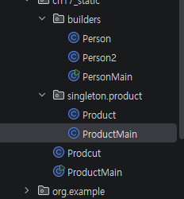

# Object
_모든 클래스는 object 클래스를 상속_ 받는다.
그래서 interface를 implemnts 할 때나 다른 서브 클래스를 만들어서 extends 입력했다고 했을때<br>
우리가 직접 만들었던 슈퍼클래스 이외에 alt+ins 눌러보면 to String() 같은것들이 추가되어 있었다.

1. toString() : 기본적으로 모든 클래스는 Object 클래스를 상속 받아서 클래스 이름과 해시코드를 return함.
    - 이를 오버라이드하여 재정의하고 출력에 사용가능
    - 필드를 정의하고, toString() 메서드를 오버라이드해서 필요한 필드들을 출력함
    -> 추가적으로 객체의 이름만으로 출력이 가능하기때문에 체인메소드를 쓰지 않아도 된다.
    'System.out.println(객체명)'
        - 왜 배열과 다르게 객체는 가능한가? 말그대로
        자료형과 객체이기 때문이다.
        자료형은 Arrays.toString(배열명)을 해야한다.

2. equals() : String에서의 두 객체가 '논리적으로 같은지' 비교하는 메서드
Object class에서 두객체의 참조주소를 비교한다.

3. hashCode() : 객체를 정수값(해시값)으로 변환
주로 해시 기반 컬렉션에 사용
    - equals() 메서드를 재정의하면 hashCode()메서드도 재정의 해야만한다.
    동일한 객체는 동일환 해시코드를 가져야하기 때문인데, 문제는 해시코드가 같다고 해서 또 equals가 true가 아닌 경우가 있기 때문이다.

# Lombok
인텔리제이기준 좌측 상다느이 메뉴바 -> 설정 -> 플러그인 선택 -> 롬복검색 -> 설치후 disable이 뜨면 설치가 완료된것
<br>
chrome -> mvn 검색 -> lombok검색 -> 최신버전 -> gradle에 groovy로 만들었으니 저기서도 코틀린을 쇼트 그루비로 설정을 바꿔준다.
-> build.gradle로 가서 addotationProcessor도 이하와 같이 추가
```java
dependencies {
    testImplementation platform('org.junit:junit-bom:5.10.0')
    testImplementation 'org.junit.jupiter:junit-jupiter'
    testRuntimeOnly 'org.junit.platform:junit-platform-launcher'
    implementation 'org.projectlombok:lombok:1.18.42'//Lombok추가
    annotationProcessor 'org.projectlombok:lombok:1.18.42'//Lombok추가,
}

```

그리고 아무 클래스에 들어가서 @Getter등을 입력했을때 경로가 Lombok으로 나오면 적용이 성공했음을 알 수 있다.<br>

## Lombok 주요 anntotaion
1. @Setter , @Getter

```java
@Setter
@Getter
public class Person{
    private name;
}

 ```

2. @ToString
    - toString() 메서드를 자동생성. 문제는 재정의가 안되고 오버라이드할 필요가 있다.

3. @EqulAndHashCode
    - equals / hashCode 메소드를 자동생성, 객체의 동일성 비교
        - equals를 고치면 반드시 hashCode도 고쳐야해서 세트로 묶여있다.

4. @NoArgsConstructor / @RequiredArgsConstructor / @AllArgsConstructor
 - 매개변수가 없는 기본생성자
 - final 또는 @NonNull 에너테이션이 붙은 field만 필수적으로 요구하는 매개변수 생성자
 - 모든 field를 인자로 요구하는 매개변수 생성자

 5. @Data
    - @Getter / @Setter / @ToString / @EqualsAndHashCode/ @RequiredArgsConstructor가
    다 들어가있는 종합 패키지 에너테이션

6. @Builder - 추후수업예정

# Static

## 정의 
    - 클래스 수준에서 변수를 정의하거나 메서드를 선언할 때 사용
    - static으로 선언된 변수나 메서드는 클래스의 '인스턴스에 속하지 않음'
    - 클래스 자체에 속하게됨
    - 이는 인스턴스를 생성하지 않고 접근이 가능하다는 점에서 일반적인 field,method와 구분됨

## 특징
    1. 공유 : 모든 인스턴스가 동일한 static 변수에 접근, 따라서 데이터를 공유하거나 상태를 저장할때 유용
    2. 클래스 수준의 변수 및 메서드 : static 변수와 메서드는 클래스 로드 시 메모리에 할당

```java
//일반 필드에 ~~

@Getter
@Setter
public class KoreaItStudent12 extends KoreaItStudent{
    //field 선언
    private String name;
    private int age;
    private String address;
    private String introduction ="코리아 아이티 국비 과정 12월";
}

public class Main{
    public static void main(String[] args){
        KoreaItStudent12 student1 = new KoreaItStudent12();

    }
}

```

```java

@Getter
@Setter
public class KoreaItStudent12 extends KoreaItStudent{
    //정적 변수 선언
    private static String introduction ="코리아 아이티 국비 과정 12월";

    //field 선언
    private String name;
    private int age;
    private String address;
    
}

public class Main{
    public static void main(String[] args){
        KoreaItStudent12 student1 = new KoreaItStudent12();

    }
}

```

이상의 Kor~클래스의 인스턴스들은 다 동일한 private static String '정적 변수'를 갖게 된다.
즉 어느 클래스의 인스턴스인지만 확인하더라도 몇 월 국비생인지 알 수 있다.<br>
    3. 인스턴스가 필요 없음 : 객체를 생성ㅇ하지 않고도 클래스명.field/메서드명 형태로 접근가능<br>
    4. 메모리 효율성 : static 변수는 프로그램이 종료될 때까지 한 번만 메모리에 할당됨

# Builder Pattern(빌더 패턴)
```Java
@AllArgsConstructor
public class Student{
    //매우 많은 필드가 있다고 가정

}

public class void main(){
    Student std = new Student(/*여기에 그 많은 필드 순서대로 다 넣어야함*/);
}

``` 

## 빌더 패턴이 생기게 된 원인
1. 복잡한 생성자 문제
    - 객체의 field가 많아질 수록 생성자 매개변수 수도 늘어남.
        - 롬복을 쓰니까 생성자 코드라인이 적을 수 있지만
        - 필수적인 부분에 @NonNull이나 final을 써야하고, 그와중에 final을 쓰면 기본 생성자는 못만드는 등
        여러가지 제약이 있다.
2.  생성자 오버로딩 문제
    - 생성자에 필요한 조합이 다를 경우 수많은 생성자를 하나씩 정의해야 한다.
        - 예를 들면 회원가입에 원랜 집전화가 필수였다가 선택으로 바뀐것 처럼
    - 유지보수에 악영향 
3. 가독성 문제
    - 코드를 작성하고 읽는 입장에서는 객체를 생성할 때 어떤 값이 어떤 field에 해당하는 명확하지 않아서
    실수를 유발할 수 있음

## 정의
객체의 생성과정에서 '복잡한 생성자'를 대신하여 '단계적으로' 객체를 생성 할 수 있는 디자인 패턴 중 생성 파트관련.
GoF(갱오브포) 디자인 패턴중 하나로 객체 생성시 가독성과 유연성을 제공하는 것이 목표

- 이상에서의 유연성의 의미는 field를 순서대로 채워넣지 않아도 되고, 순서를 바꾸더ㅗ라도 정확한 field에 원하는 값을 집어넣을 수 있다는 것을 의미합니다.

## 특징
1. 객체를 생성하는 여러 개의 field를 명시적으로 관리 가능
2. 불필요한 생성자 오버로딩을 줄여 가독성을 늘림
3. 체이싱 메서드를 사용하여 객체를 직관적으로 생성

builder 패턴 복습필요

